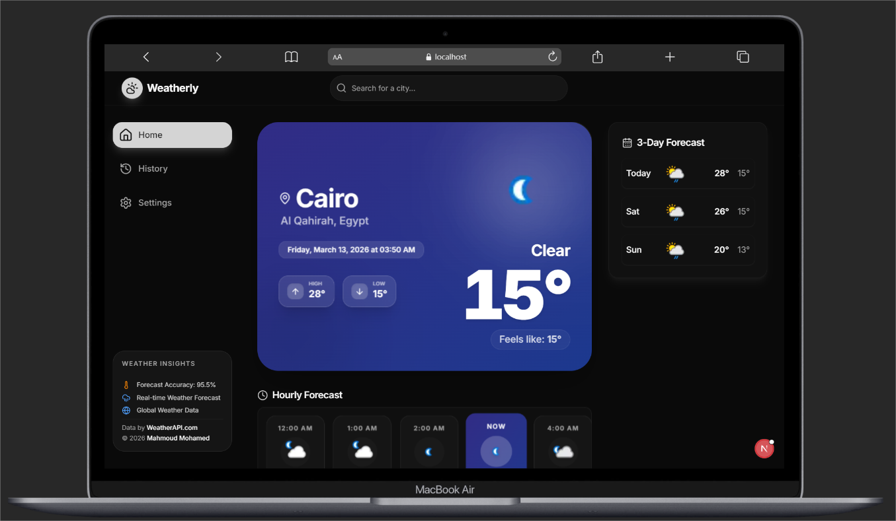
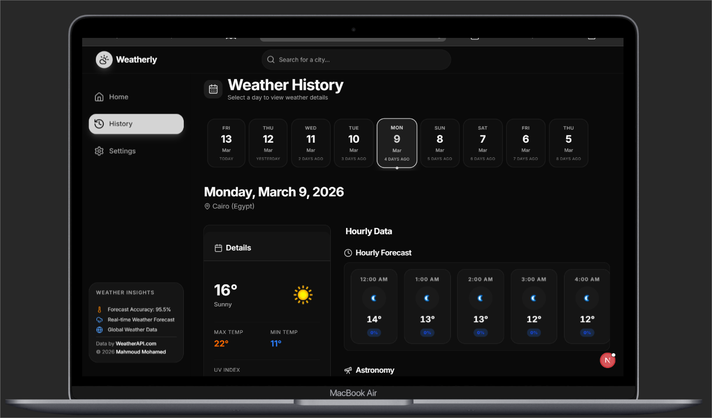
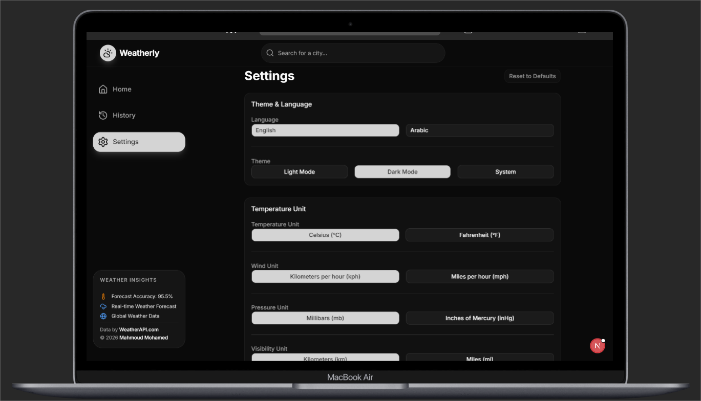

# ☁️ Weatherly

A feature-rich, multilingual weather dashboard application.

## 🖼️ Preview

<p align="center">
  <strong>Home Dashboard</strong><br>
  
</p>

<p align="center">
  <strong>Weather History</strong><br>
  
</p>

<p align="center">
  <strong>User Settings</strong><br>
  
</p>


## ✨ Features

- 🌡️ Real-time current weather with detailed metrics
- 📊 Hourly & 3-day forecast
- 📅 Historical weather data (up to 9 days back)
- 🌙 Astronomy section (sunrise, sunset, moon phases)
- 🗺️ Interactive weather maps
- 🌍 Multi-language support (English & Arabic)
- 🎨 Light/Dark theme with system preference detection
- ⚙️ Customizable units (°C/°F, kph/mph, mb/inHg, etc.)
- 📱 Fully responsive design

## 🛠️ Tech Stack

- **Framework:** Next.js 16 (App Router)
- **Language:** TypeScript
- **Styling:** TailwindCSS + Shadcn UI
- **State Management:** Zustand
- **Data Fetching:** TanStack Query + Axios
- **Internationalization:** next-intl
- **Theming:** next-themes
- **Icons:** Lucide React
- **API:** WeatherAPI.com

## 📋 Prerequisites

Before you begin, make sure you have the following installed:

- [Node.js](https://nodejs.org/) (v18.0 or higher)
- [npm](https://www.npmjs.com/) (v9.0 or higher) or [yarn](https://yarnpkg.com/)
- A free API key from [WeatherAPI.com](https://www.weatherapi.com/)

## 🚀 Getting Started

### 1. Clone the repository

```bash
git clone https://github.com/mahmood-mohamed/weatherly.git
cd weatherly
```

### 2. Install dependencies

```bash
npm install
```

### 3. Set up environment variables

Create a `.env.local` file in the root directory:

```bash
cp .env.example .env.local
```

Then add your API key:

```env
NEXT_PUBLIC_WEATHER_API_KEY=your_api_key_here
```

> 💡 You can get a free API key by signing up at [weatherapi.com](https://www.weatherapi.com/signup.aspx)

### 4. Run the development server

```bash
npm run dev
```

Open [http://localhost:3000](http://localhost:3000) in your browser to see the app.

## 📜 Available Scripts

| Command           | Description                        |
| ----------------- | ---------------------------------- |
| `npm run dev`     | Start the development server       |
| `npm run build`   | Build the app for production       |
| `npm run start`   | Start the production server        |
| `npm run lint`    | Run ESLint for code quality checks |

## 📁 Project Structure

```
weatherly/
├── public/                  # Static assets
├── src/
│   ├── app/                 # Next.js App Router pages
│   │   └── [locale]/        # Internationalized routes
│   │       ├── history/     # Weather history page
│   │       └── settings/    # User settings page
│   ├── components/
│   │   ├── ui/              # Reusable UI components (Shadcn)
│   │   ├── molecules/       # Composite components
│   │   └── organisms/       # Complex feature components
│   ├── hooks/               # Custom React hooks
│   ├── lib/                 # Utilities & API functions
│   ├── messages/            # i18n translation files (en/ar)
│   └── store/               # Zustand state management
├── .env.local               # Environment variables (create manually)
├── tailwind.config.ts       # TailwindCSS configuration
└── next.config.ts           # Next.js configuration
```

## 🤝 Contributing

Contributions are welcome! Feel free to open an issue or submit a pull request.

1. Fork the repository
2. Create your feature branch (`git checkout -b feature/amazing-feature`)
3. Commit your changes (`git commit -m 'Add some amazing feature'`)
4. Push to the branch (`git push origin feature/amazing-feature`)
5. Open a Pull Request

## 📄 License

This project is licensed under the MIT License.

---

<p align="center">Made with ❤️ by <strong>Mahmoud Mohamed</strong></p>
